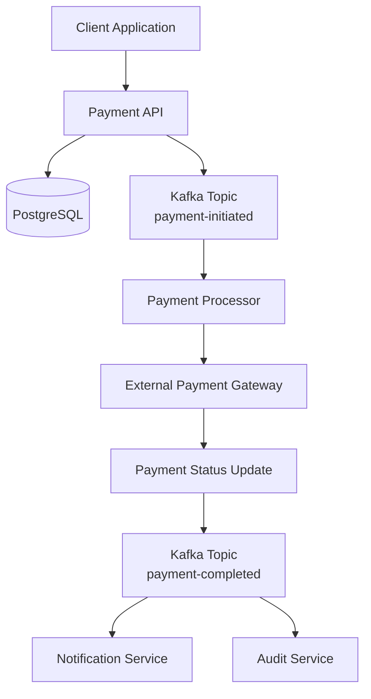
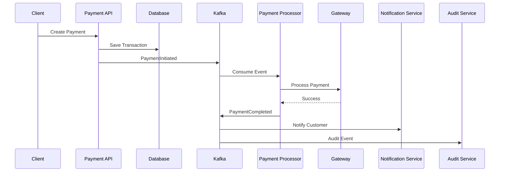
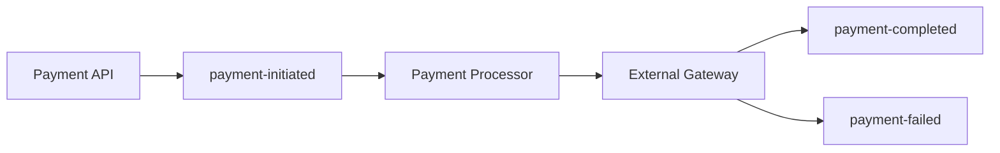
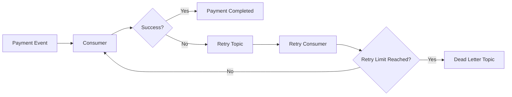

# Kafka Payment Engine

A reference implementation and architecture guide for building scalable, event-driven payment processing systems using Apache Kafka, Spring Boot, PostgreSQL, and distributed system design principles.

## Overview

This repository demonstrates how modern payment systems can leverage Apache Kafka for reliable, scalable, and asynchronous transaction processing.

The architecture focuses on:

* Payment Initiation
* Event-Driven Processing
* Payment Status Tracking
* Retry Mechanisms
* Dead Letter Topics (DLT)
* Idempotency
* Distributed Processing
* Observability

## Architecture



## Payment Lifecycle



## Core Components

| Component               | Responsibility                  |
| ----------------------- | ------------------------------- |
| Payment API             | Accept payment requests         |
| Kafka Producer          | Publish payment events          |
| Payment Processor       | Process payments asynchronously |
| Payment Gateway Adapter | External gateway integration    |
| Status Service          | Track transaction lifecycle     |
| Notification Service    | Customer notifications          |
| Audit Service           | Compliance & audit logging      |

## Kafka Topics

| Topic              | Purpose              |
| ------------------ | -------------------- |
| payment-initiated  | New payment requests |
| payment-processing | Processing status    |
| payment-completed  | Successful payments  |
| payment-failed     | Failed payments      |
| payment-retry      | Retry queue          |
| payment-dlt        | Dead Letter Topic    |

## Event Flow



## Retry & Dead Letter Topic Strategy



## Idempotency Design

Financial systems must prevent duplicate payment processing.

### Strategy

* Unique Payment Reference
* Idempotency Key
* Database Constraints
* Consumer Deduplication

Example:

```text
Payment Reference:
PAY-20260601-1001

Duplicate Event:
Rejected

Existing Payment:
Returned
```

## Reliability Patterns

### Retry Mechanism

* Exponential Backoff
* Configurable Retry Count
* Retry Topics

### Dead Letter Topics

Failed messages are moved to DLT after maximum retries.

### Consumer Groups

Consumer groups enable horizontal scaling and fault tolerance.

### At-Least-Once Processing

Kafka guarantees message delivery while idempotency protects against duplicate processing.

## Technology Stack

| Layer      | Technology         |
| ---------- | ------------------ |
| Backend    | Java, Spring Boot  |
| Messaging  | Apache Kafka       |
| Database   | PostgreSQL         |
| Cache      | Redis              |
| Monitoring | ELK, Grafana       |
| Security   | OAuth2, JWT        |
| Deployment | Docker, Kubernetes |

## Monitoring

Important business metrics:

* Payments Initiated
* Payments Completed
* Payments Failed
* Retry Count
* DLT Count
* Gateway Latency
* Processing Time

## Future Enhancements

* Saga Pattern
* Outbox Pattern
* Event Sourcing
* Multi-Gateway Support
* Fraud Detection Engine
* AI-Powered Transaction Monitoring

## Use Cases

* Digital Lending Platforms
* Payment Gateways
* Wallet Systems
* Banking Applications
* FinTech Platforms
* Transaction Processing Systems

## Author

Mohammad Adil

🏦 FinTech Backend Lead
☕ Java Architect
⚡ Kafka & Microservices
🤖 AI Engineer
