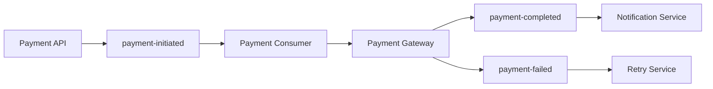

# Kafka Event Flow

```mermaid
flowchart LR

A[Payment API]
--> B[payment-initiated]

B --> C[Payment Consumer]

C --> D[Payment Gateway]

D --> E[payment-completed]

D --> F[payment-failed]

E --> G[Notification Service]

F --> H[Retry Service]
```
