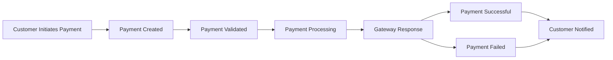

# Payment Lifecycle

```mermaid
flowchart LR

A[Customer Initiates Payment]
--> B[Payment Created]

B --> C[Payment Validated]

C --> D[Payment Processing]

D --> E[Gateway Response]

E --> F[Payment Successful]

E --> G[Payment Failed]

F --> H[Customer Notified]
G --> H
```
