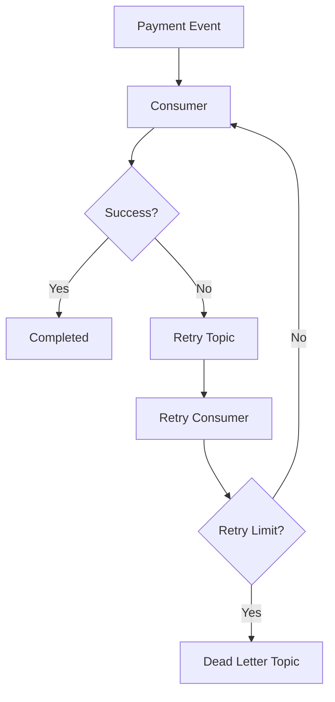

# Retry and Dead Letter Topic Flow

```mermaid
flowchart TD

A[Payment Event]
--> B[Consumer]

B --> C{Success?}

C -->|Yes| D[Completed]

C -->|No| E[Retry Topic]

E --> F[Retry Consumer]

F --> G{Retry Limit?}

G -->|No| B

G -->|Yes| H[Dead Letter Topic]
```

